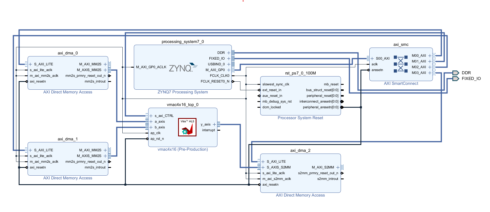
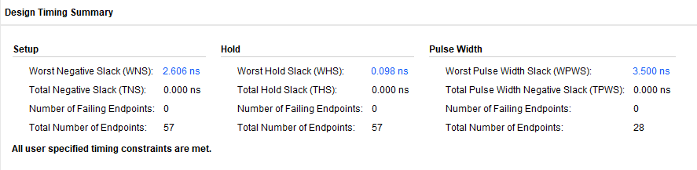

# 🚀 128-bit Vector Multiply-Accumulate (VMAC) Hardware Accelerator  
**FPGA SoC Integration | Verilog, Vitis HLS, Vivado, AXI/DMA, TinyML Optimization**

## 🧩 Overview  
This project implements a **128-bit pipelined Vector Multiply-Accumulate (VMAC) hardware accelerator** designed for **DSP** and **TinyML** workloads on Xilinx SoC platforms.  
Developed and validated using **Verilog** and **Vitis HLS**, the accelerator enables **parallel vector arithmetic** with high throughput, optimized latency, and efficient FPGA resource utilization.

It was integrated on a **Zynq SoC** using **AXI4-Stream** and **AXI DMA** interfaces for high-speed communication between programmable logic and the ARM processor.  
At 200 MHz, the accelerator achieves up to **~40 GOPS** throughput with **< 1 % timing slack**, using only **~70 LUTs and 4 DSPs per lane**, proving both scalability and efficiency for low-power embedded inference applications.

---

## ⚙️ Key Features
- **128-bit Parallel Processing:** 4 × 16 INT16 lanes, each performing pipelined multiply-accumulate operations.  
- **2-Stage Pipeline Datapath:** Utilizes DSP48 slices for single-cycle multiply and accumulate throughput.  
- **AXI4-Stream / AXI DMA Integration:** Enables seamless data streaming and low-latency processor communication.  
- **Scalable and Reusable IP:** Designed as a reusable IP core with AXI-Lite control and performance monitoring.  
- **TinyML Optimization:** Balances compute density, area efficiency, and latency for embedded ML acceleration.  
- **Resource Efficiency:** Achieved < 1 % timing slack @ 200 MHz with ~70 LUTs and 4 DSPs per lane.  

---

## 🧠 Design Highlights
- Fully **pipelined** datapath for high-throughput vector arithmetic.  
- **AXI-Lite control interface** for start/stop, performance counters, and vector length configuration.  
- **C/RTL Co-Simulation and Hardware-In-Loop Testing** performed through Vivado & Vitis HLS.  
- **Stress-tested and validated** for arithmetic precision, timing closure, and resource utilization.  
- **Reusable in heterogeneous SoCs**, enabling modular integration with CPUs or other accelerators.  

---

## 🧮 Performance Summary
| Metric | Result |
|:--|:--|
| Frequency | 200 MHz |
| Throughput | ~40 GOPS |
| Latency | Single-cycle MAC per lane |
| Timing Slack | < 1 % |
| Resource Utilization | ~70 LUTs, 4 DSPs per lane |
| Datapath Width | 128 bits (4 × 16 INT16 lanes) |

---

## 🧰 Tools & Technologies
- **Languages:** Verilog, C/C++ (HLS)  
- **EDA Tools:** Vivado, Vitis HLS, ModelSim  
- **Hardware Platform:** Xilinx Zynq SoC (PYNQ-Z1)  
- **Validation Tools:** Logic Analyzer, Oscilloscope (for hardware-in-loop testing)  
- **Version Control:** Git & GitHub  

---

## ✅ Validation & Testing
- **C/RTL Co-Simulation:** Verified arithmetic correctness and pipeline timing across random input vectors.  
- **Hardware-In-Loop:** Implemented and validated on FPGA board using AXI-DMA data transfers.  
- **Synthesis & Timing Analysis:** Closed timing at 200 MHz with < 1 % slack; confirmed area efficiency.  
- **Stress Testing:** Random-vector testbench for overflow detection, corner-case handling, and throughput stability.  

---

## 🧩 Future Enhancements
- Extend to **radix-based division / multiplication units** for RISC-V vector processors.  
- Add **parameterized precision support** (INT8/INT16/FP32).  
- Integrate **software-configurable accumulation modes** via AXI-Lite.  
- Explore **ASIC porting and TinyML benchmarking** for further performance scaling.  

---

## 📚 License
This project is released under the **MIT License** — you’re free to use, modify, and distribute it with attribution.

---

## 👤 Author
**Nahum Pilli**  
📍 Richardson, TX  
🔗 [LinkedIn](https://linkedin.com/in/nahum-pilli-9b7495230) | 📧 nahumpilli@gmail.com  

