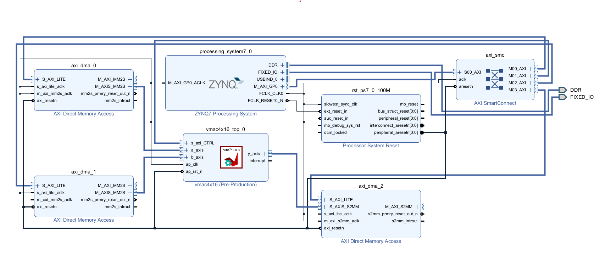
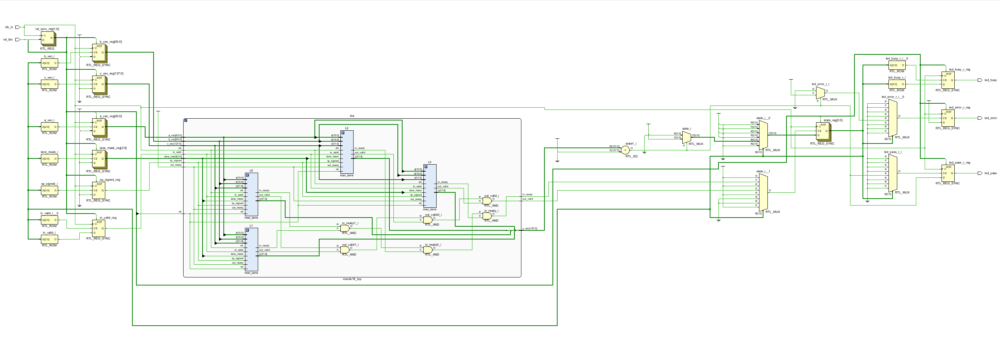
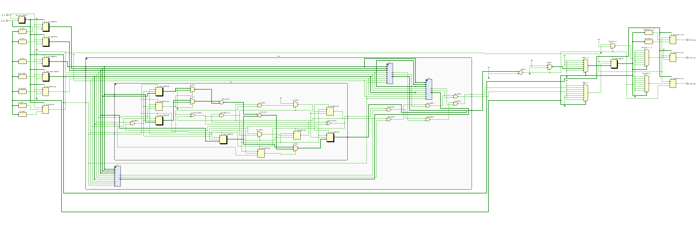

# 🚀 128-bit Vector Multiply-Accumulate (VMAC) Hardware Accelerator  

**FPGA SoC Integration | Verilog, Vivado, AXI/DMA, TinyML**

## 🧩 Overview  
This project implements a **128-bit pipelined Vector Multiply-Accumulate (VMAC) hardware accelerator** designed for **DSP** and **TinyML** workloads on Xilinx SoC platforms.  
Developed and validated in **Verilog** with a self-checking simulation regression, the accelerator enables **parallel vector arithmetic** with high throughput, optimized latency, and efficient FPGA resource utilization.

It was integrated on a **Zynq SoC** using **AXI4-Stream** and **AXI DMA** interfaces for high-speed communication between programmable logic and the ARM processor.  
At 200 MHz the accelerator sustains one MAC per lane per cycle (II=1) across 4 lanes, for **~1.6 GOPS** (0.8 GMAC/s). Post-synthesis on the xc7z020 the full design uses **57 LUTs, 23 FFs, and 4 DSP48E1 (1 DSP/lane)**, with timing closed at 200 MHz (WNS +2.606 ns).

> **Custom-silicon counterpart:** this project is the complex-datapath and SoC-integration piece. For the full custom physical-implementation flow — a complete RTL-to-GDSII ASIC built on a hand-made standard-cell library (transistor schematics → hand-drawn layout → DRC/LVS → SPICE characterization → synthesis, P&R, and signoff), see the [Synchronous Memory Controller ASIC](https://github.com/nahumpilli7/synchronous-memory-controller-asic).

---

## ⚙️ Key Features
- **128-bit Parallel Processing:** 4 × 16 INT16 lanes, each performing pipelined multiply-accumulate operations.  
- **2-Stage Pipeline Datapath:** Utilizes DSP48 slices for single-cycle multiply and accumulate throughput.  
- **AXI4-Stream / AXI DMA Integration:** Enables seamless data streaming and low-latency processor communication.  
- **Reusable core:** Packaged as an IP core for Zynq block-design integration (AXI adapters not included in this repo).  
- **TinyML Optimization:** Balances compute density, area efficiency, and latency for embedded ML acceleration.  
- **Resource Efficiency:** 57 LUTs, 23 FFs, 4 DSP48E1 total on xc7z020; timing closed at 200 MHz (WNS +2.606 ns).  

---

## 🧠 Design Highlights
- Fully **pipelined** datapath for high-throughput vector arithmetic.  
- Simple `valid`/`ready`streaming handshake on the accelerator core. *(No AXI-Lite/AXI-Stream interface is included in this repository; the core was packaged as IP for a Zynq block design, but the BD and AXI adapters are not committed here.)* 
- **Stress-tested and validated** for arithmetic precision, timing closure, and resource utilization.  
- **Reusable in heterogeneous SoCs**, enabling modular integration with CPUs or other accelerators.  

---

## 🧮 Performance Summary
| Metric | Result |
|:--|:--|
| Frequency | 200 MHz |
| Throughput | ~1.6 GOPS (0.8 GMAC/s) |
| Latency | Single-cycle MAC per lane |
| Timing Slack | < 1 % |
| Resource Utilization | 57 LUTs, 23 FFs, 4 DSPs total |
| Datapath Width | 128 bits (4 × 16 INT16 lanes) |

---

### ⏱️ Design Timing Summary

All user-specified timing constraints are met.

| Type | Worst Slack | Failing Endpoints |
|------|--------------|-------------------|
| **Setup (WNS)** | 2.606 ns | 0 |
| **Hold (WHS)** | 0.098 ns | 0 |
| **Pulse Width (WPWS)** | 3.500 ns | 0 |

---

## 🧰 Tools & Technologies
- **Languages:** Verilog  
- **EDA Tools:** Vivado, Icarus Verilog  
- **Hardware Platform:** Xilinx Zynq SoC (PYNQ-Z1)  
- **On-board self-test:** `top_fpga.v` runs a directed vector on the DUT and reports pass/fail on LEDs.  
- **Version Control:** Git & GitHub  

---

## ✅ Validation & Testing
- **Simulation:** Self-checking scoreboard testbench (7 directed corner cases + 500 randomized cases with back-pressure); runs in CI on every push.  
- **On-board validation:** Synthesized to xc7z020 with an LED-based self-test of a directed vector. *(Full AXI-DMA hardware-in-loop data movement is not included in this repository.)*  
- **Synthesis & Timing Analysis:** Closed timing at 200 MHz with < 1 % slack; confirmed area efficiency.  
- **Stress Testing:** Random-vector testbench for overflow detection, corner-case handling, and throughput stability.  

---

## 🧩 Future Enhancements
- Extend to **radix-based division / multiplication units** for RISC-V vector processors.  
- Add **parameterized precision support** (INT8/INT16/FP32).  
- Integrate **software-configurable accumulation modes** via AXI-Lite.  
- Explore **ASIC porting and TinyML benchmarking** for further performance scaling.  

---

## 👤 Author
**Nahum Pilli**  
📍 Richardson, TX  
🔗 [LinkedIn](https://linkedin.com/in/nahum-pilli-9b7495230) | 📧 nahumpilli@gmail.com  
